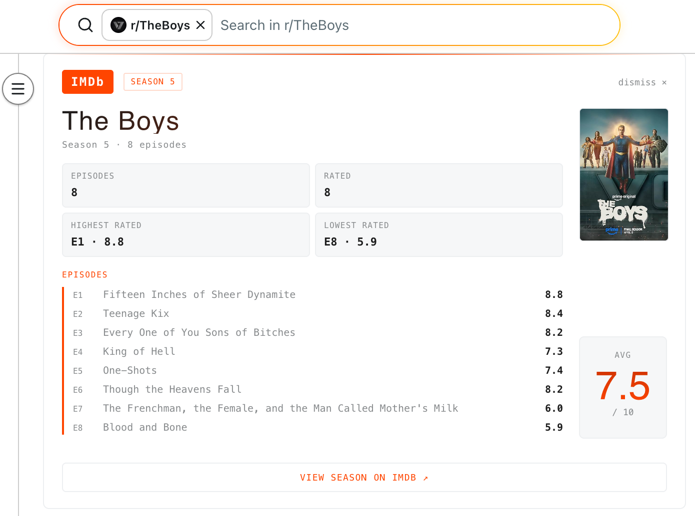

# Cold Open

A Chrome/Arc browser extension that automatically injects IMDB ratings into Reddit episode and season discussion threads.

## What it does

When you open a Reddit discussion thread for a TV episode or season, Cold Open detects the show and episode from the thread title and injects a card above the comments with:

- Episode/season IMDB rating and vote count
- Release date and runtime
- Plot summary
- Cast
- Show poster
- For season threads: per-episode ratings, highest/lowest rated episodes, and season average

## Supported thread formats

- `Show S01E01 - Episode Title`
- `Episode Discussion: S01E01`
- `Episode Discussion - S01E01 - Title`
- `Show 2x01`
- `Show - Season 5 Discussion`
- `Act 1, Ep 1`
- `eps1.0` / `1.0` (Mr Robot S1-S3 style)
- `403`
- Movie discussion threads on r/movies and similar subs

## Features

- Auto light/dark mode detection to match Reddit's theme
- Poster thumbnail pulled from OMDB
- 24-hour cache so repeated visits don't re-fetch
- Dismiss with the button or press Esc
- Works on reddit.com and old.reddit.com
- Works on Arc and Chrome

## Setup

1. Clone the repo
2. Run `npm install`
3. Get a free API key at [omdbapi.com](https://www.omdbapi.com)
4. Create a `.env` file in the root: `VITE_OMDB_KEY=your_key_here`
5. Run `npm run build`
6. Go to `chrome://extensions`, enable Developer mode, click Load unpacked, select the `dist` folder

## Stack

- React 18 + TypeScript
- Vite
- OMDB API
- `chrome.storage.local` for caching
